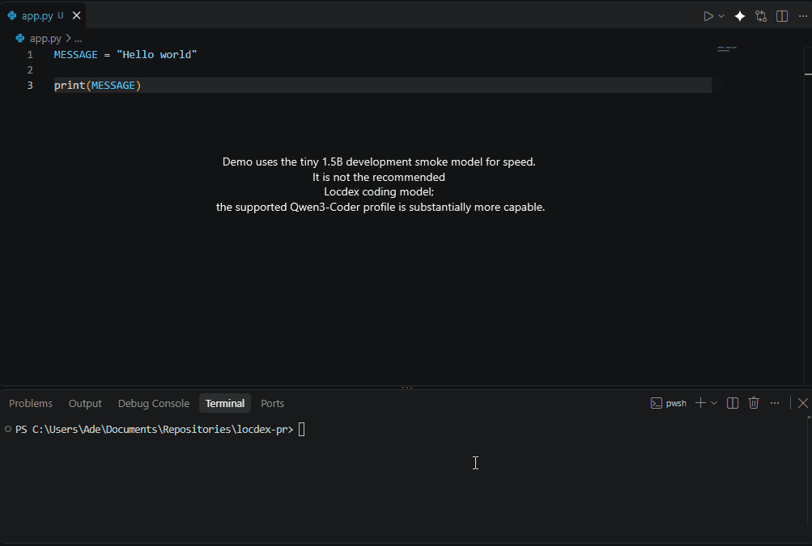

# Locdex

**A local-first AI coding agent that works directly in your repository.**

Locdex can inspect your codebase, edit files, run commands and tests, inspect diffs, and perform Git operations when you explicitly authorize them.

It is built around a simple idea: **routine coding work should be able to run locally without requiring a paid frontier-model API for every task.**

When you want more capability, Locdex can optionally use a cloud model that **you configure**.

## Why Locdex?

Most AI coding workflows push developers toward one of two extremes: use a cloud model for everything, or wire a local model into tooling that was primarily designed around frontier models.

Locdex is being built local-first.

It combines:

- local model execution;
- hardware-aware runtime setup;
- direct workspace editing;
- bounded agent tools;
- automatic validation and test execution;
- explicit Git permissions;
- optional cloud fallback;
- lightweight local memory;
- opt-in, aggregate-only telemetry.

**Ollama is not required.**

## Quick Start

Install Locdex:

```bash
pip install locdex
```

Run setup:

```bash
locdex setup
```

Enter a project:

```bash
cd your-project
locdex chat
```

Then give Locdex a task:

```text
> find the authentication bug and fix it
```

Locdex can inspect relevant files, make changes, run tests, and inspect the resulting diff.

Git mutations require explicit intent:

```text
> commit these changes
```

or:

```text
> push this branch
```

Locdex will not decide on its own that your code should be committed or pushed.

## What It Looks Like

```text
$ locdex chat

> fix the empty-token authentication bug

[agent] searches the repository
[agent] reads relevant implementation and tests
[agent] edits the affected files
[agent] runs tests
[agent] inspects git diff

✓ Fixed empty-token handling.
✓ Tests passed.

> commit it

[agent] git status
[agent] git add ...
[agent] git commit ...

✓ Committed.
```



> **Demo note:** This GIF uses Locdex's tiny 1.5B development smoke model for speed. It is not the recommended Locdex coding model; the supported Qwen3-Coder profile is substantially more capable.

## Local Models

Locdex v1.3.1 currently ships with two local model profiles.

### Qwen3-Coder — supported default

- Model: `Qwen/Qwen3-Coder-30B-A3B-Instruct`
- GGUF: `unsloth/Qwen3-Coder-30B-A3B-Instruct-GGUF`
- Quantization: `Q4_K_M`
- Approximate download: **18.6 GB**
- Recommended system RAM: **32 GB**
- Status: **supported/default**

Install directly:

```bash
locdex setup --model qwen
```

### Kimi-derived 9B — experimental

- Upstream: `khazarai/Qwen3.5-9B-Kimi-k3-Distilled`
- GGUF: `mradermacher/Qwen3.5-9B-Kimi-k3-Distilled-GGUF`
- Quantization: `Q4_K_M`
- Approximate download: **5.8 GB**
- Practical system RAM target: **16 GB**
- Status: **experimental**

Install directly:

```bash
locdex setup --model kimi
```

Both models can be installed on the same system. Only the selected model is loaded for a session.

## Hardware-Aware Setup

`locdex setup` detects the host machine and attempts to install an appropriate prebuilt local inference runtime.

| Hardware | Typical runtime |
|---|---|
| Apple Silicon | Metal |
| NVIDIA GPU | CUDA |
| Linux AMD GPU | ROCm |
| Windows AMD GPU | HIP Radeon when enabled |
| Linux/Windows with Vulkan | Vulkan fallback |
| Other systems | CPU |

Locdex deliberately prefers prebuilt binary runtimes instead of silently compiling a local C/C++ runtime during installation.

If GPU model loading fails, Locdex can retry on CPU rather than immediately ending the session.

## Built for Agents, With Boundaries

Locdex gives the model development tools rather than unrestricted Python or shell access.

It can:

- search and read repository files;
- edit files inside the workspace;
- delete permitted files and empty directories;
- run bounded development commands;
- run tests;
- inspect Git status and diffs;
- stage, commit, pull, and push through dedicated Git tools.

It cannot directly escape the repository workspace or manipulate protected `.git` internals.

The general command runner also cannot invoke `git` or `gh` to bypass Locdex's Git permission system.

## Local First. Cloud When You Choose.

Cloud fallback is disabled until you configure it.

Locdex does not force a particular cloud provider or frontier model.

### OpenRouter

```bash
export LOCDEX_CLOUD_PROVIDER="openrouter"
export LOCDEX_CLOUD_MODEL="your-selected-provider/model"
export OPENROUTER_API_KEY="..."
```

### Anthropic

```bash
export LOCDEX_CLOUD_PROVIDER="anthropic"
export LOCDEX_CLOUD_MODEL="your-selected-claude-model"
export ANTHROPIC_API_KEY="..."
```

### Any OpenAI-compatible endpoint

```bash
export LOCDEX_CLOUD_PROVIDER="custom"
export LOCDEX_CLOUD_MODEL="your-selected-model"
export LOCDEX_CLOUD_BASE_URL="https://your-provider.example/v1/chat/completions"
export LOCDEX_CLOUD_API_KEY="..."
```

The local agent remains first. Cloud escalation uses only providers and models explicitly configured by the user.

## Model Management

```bash
locdex model list
locdex model status

locdex model install qwen
locdex model install kimi

locdex model use qwen
locdex model use kimi

locdex model remove qwen
locdex model remove kimi
```

## Runtime Management

```bash
locdex runtime status
locdex runtime install
locdex runtime repair
```

## Validation

Locdex v1.3.1 passed its release gate before publication, including:

- **75 automated regression tests**
- GitHub Actions CI
- Ruff static analysis
- Python compilation checks
- wheel build
- clean-environment wheel installation
- dependency validation
- CLI launch validation
- strict release preflight validation

Coverage includes agent editing, Git-intent enforcement, model profiles, hardware detection, runtime installation policy, routing, and safety behavior.

Physical-machine testing across more hardware configurations is still ongoing.

## Install From Source

```bash
git clone https://github.com/Locdex/Locdex.git
cd Locdex
python -m pip install -e .
locdex setup
```

## Current Status

Locdex is early.

v1.3.1 establishes the stable baseline for the current architecture. There is substantially more work planned around model routing, context efficiency, hardware support, and agent reliability.

That also means this is a useful time to try it and break things.

If you test Locdex, issues containing your:

- operating system;
- RAM;
- CPU/GPU;
- selected model;
- task attempted;
- failure or unexpected behaviour;

are particularly useful.

## Documentation

- [Setup Guide](SETUP_GUIDE.md) — detailed installation and setup
- [Architecture](ARCHITECTURE.md) — system architecture
- [Build Spec](BUILD_SPEC.md) — implementation specification
- [Testing](TESTING.md) — testing and launch matrix
- [Contributing](CONTRIBUTING.md) — how to report issues and contribute changes

## Contributing

Bug reports, hardware reports, model experiments, and pull requests are welcome.

If you have a 16 GB or 32 GB machine and are willing to test Locdex on a real repository, hardware and runtime reports are especially useful.

See [CONTRIBUTING.md](CONTRIBUTING.md) for contribution guidelines.

## License

Locdex is released under the [MIT License](LICENSE).
